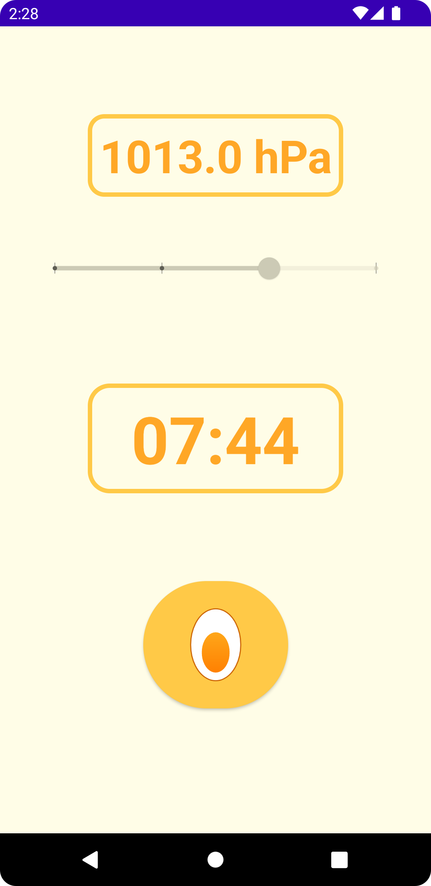

# EggTimer
Always boil your egg to your delight! The app timer calculates the perfect boiling time for your desired consistency using Charles D. H. Williams formula (https://newton.ex.ac.uk/teaching/CDHW/egg/).
This App is not ready for publish but rather a demo space for experimenting with Jetpack Compose and MVI architecture.

## Features
- `Pressure sensor`: The current altitude and pressure is derived from the smartphones sensor
- `Desired consistency`: Choose whether you want a soft, wax, half-hard or hard egg

## Modules
- `app`: The application or presentation layer. Contains composables, activities, viewmodels, states, resources, etc.
- `business`: The business or domain layer. Contains repositories and services.

## Screenshots

